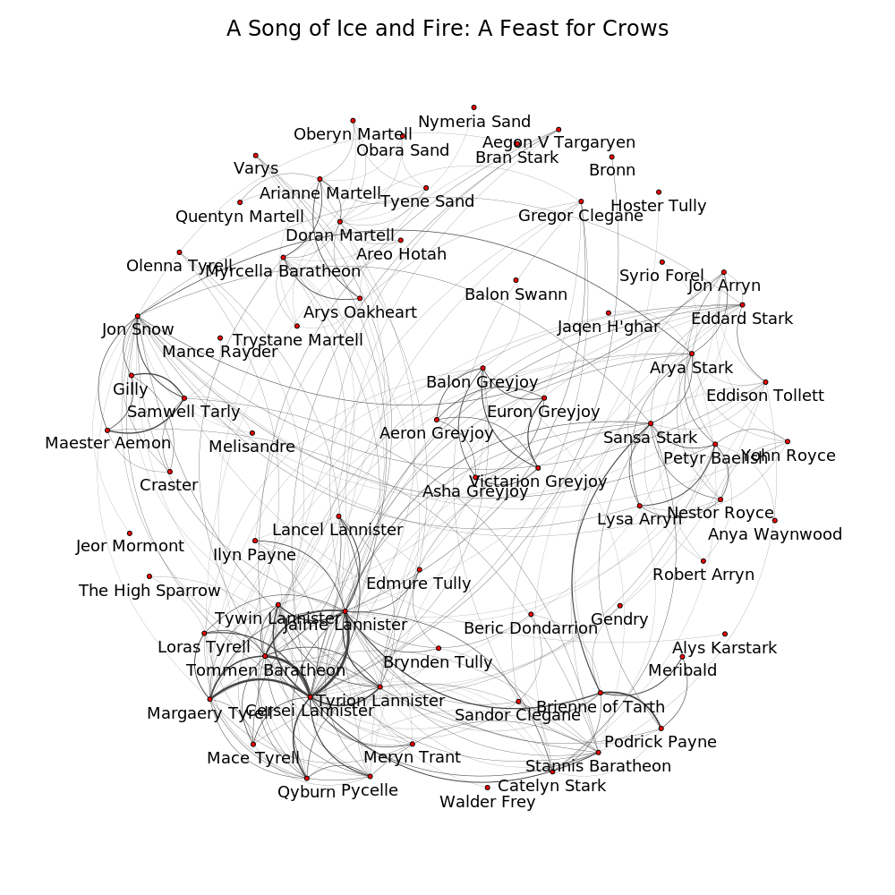
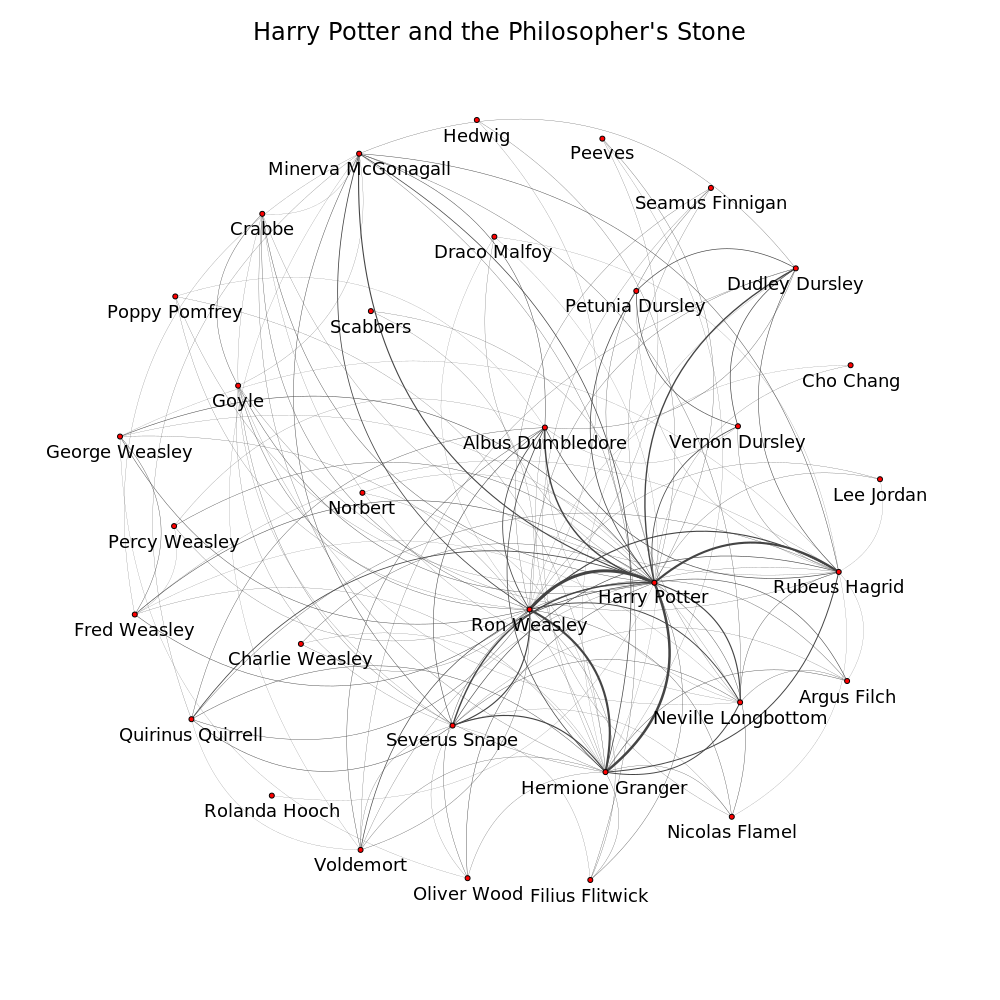
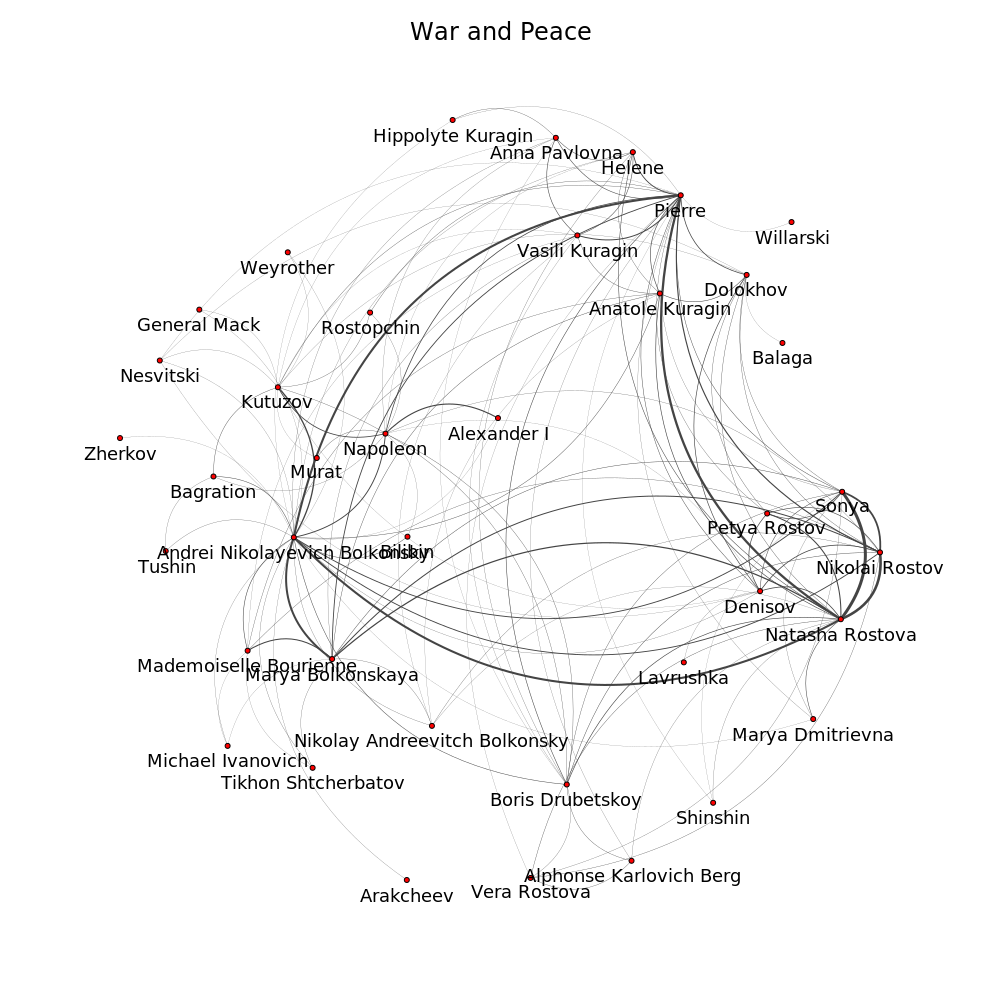

Take a book. Count the number of pages where the two given characters are mentioned together. This is a measure of how strong the characters have interacted throughout the book. Then draw a graph of the characters in a book with the weights of edges being proportional to the strengths of interactions. Here are a few examples. More can be found in the `figures` repository.

Now define a distance between two characters as sqrt((d1 + 1)(d2 + 1)) / (w12 + 1), where w12 is the weight of the edge, d_1 and d_2 are sums of weights of all the edges outgoing from the first and the second vertex respectively. We need "+1" in the denominator in order not to divide by zero occasionally if the two characters have never interacted. We need "+1"s in the numerator to avoid placing the character who is not present in the book at zero distance from everybody else.  
It is worth noting that this "distance" does not obey the triangle inequality (a triangle with weights of edges 1, 5, 5 is a counterexample), and hence is not a valid metric.  
Now take a positive *r*. If the distance between some two characters is not greater than *r*, draw an edge between them. If some three characters have pairwise distances between them not greater than *r*, draw a face containing them. Generally, if all pairwise distances between *k+1* characters are not greater than *r*, let them form a *k*-dimensional simplex. We will get a simplicial complex, known as the Vietoris-Rips complex. When a healthy person encounters a simplicial complex, he experiences an irresistible desire to compute its' homologies. So let's increase *r* from zero to infinity, track the times of birth and death of cycles, and plot them. [Ripser package](https://github.com/scikit-tda/ripser.py) was used.

It is clear that the amount of cycles depends on the number of characters. Most of the cycles are just noise. Richness of persistent homologies could be interpreted as a measure for how complicated the plot is. An interesting detail is that *A Song of Ice and Fire* (almost) hasn't third homologies while *Harry Potter* and *War and Peace* do, and except that the plots look similar. I don't have an explanation for it yet.

Also, let's justify the choise of the distance function. With an adequate distance function, a deletion of a minor character shouldn't alter the homologies much. So the natural solution would be to have a distance function that places a minor character who is a satellite to some main character, close to them. This is the first reason why I have used the distance that I used. Also, it is nice to have the distance depending almost only on the ratios of the interactions between characters with respect to their interaction with all the other characters. In other words, if we double the size of the page, the distances between characters would experience little change.
